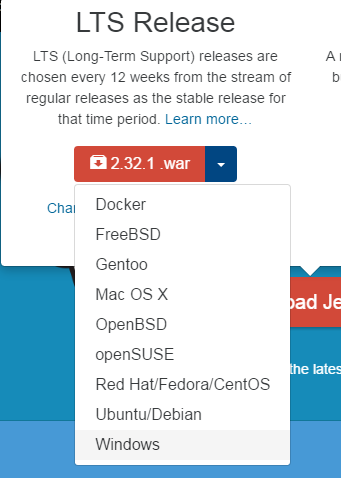
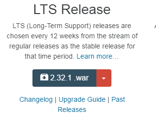

# Jenkins Install

Jenkins requires Java. If it is not installed you can download the latest JRE from [Oracle's website.](http://www.oracle.com/technetwork/java/javase/downloads/index.html)

There are 2 ways I've run Jenkins.

## Installer

This will automatically setup Jenkins as a service that runs when Windows does.

1. Download: http://mirrors.jenkins-ci.org/windows-stable/latest

   Or by going to [Jenkins](https://jenkins.io/) homepage and downloading it manually from the dropdown.

   

1. Extract the ```.msi``` installer from the downloaded ```.zip file```.

1. Run the installer.

## Java + .war

1. Download: http://mirrors.jenkins.io/war-stable/latest/jenkins.war)

   Or by going to [Jenkins](https://jenkins.io/) homepage and downloading it manually.

   

1. Open the command prompt and run ```java -jar jenkins.war```.

1. Open a web browser and navigate to http://127.0.0.1:8080

# Jenkins Setup
