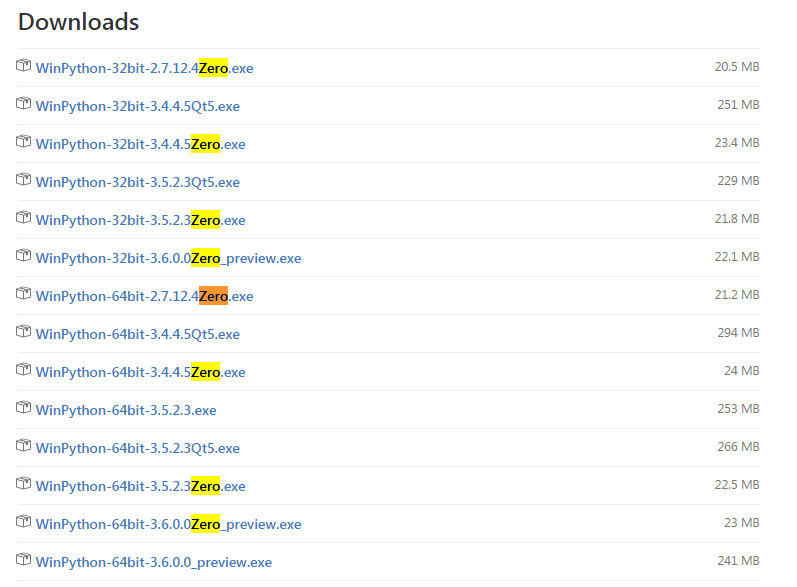
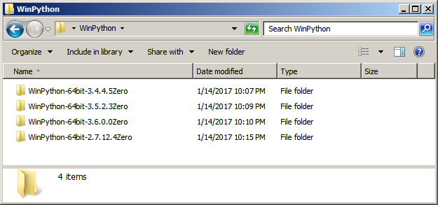
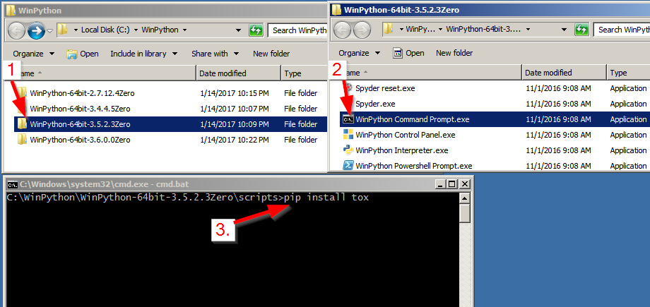
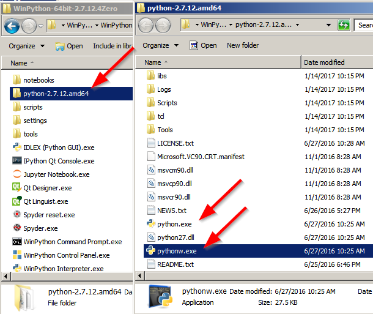
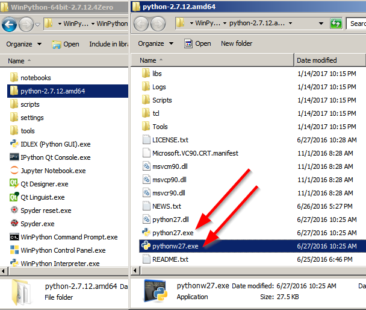
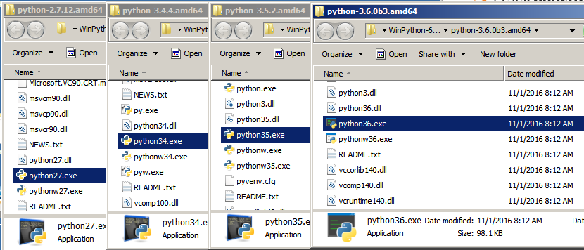

# WinPython & Tox

These instructions will show you how to use [``tox``](https://tox.readthedocs.io/en/latest/) on Windows to test against multiple v. Set up correctly you will be able to test against Python versions 2.7, 3.4, 3.5 & 3.6 on Windows.

## Setup

### Python

### WinPython.

While I personally prefer to develop on *NIX systems, in my corporate engineering day job Windows was a necessary. Most of the Python I wrote was targeting use on Windows 7 and 10.

There are multiple ways to [install multiple versions of Python](how to install multiple versions of python on windows) on Windows. I've tested them prefer to use [WinPython](https://winpython.github.io/).

- No admin privledges required. In a corporate environment with locked down permissions this makes deployment and upgrading much easier.
- It's Portable. You can move the install folders around without breaking the individual Python 'installs'.

#### Getting WinPython

For these instructions I will use Zero versions because they are small in size and tox will handle installing packages in the respective virtual environments.

The latest WinPython releases can be found on their releases page:

https://github.com/winpython/winpython/releases/

1. Download the versions of Python you wish to test against. Most Windows 7 machines will be 64-bit. ([Here is how to check if you are unsure](https://support.microsoft.com/en-us/help/15056/windows-7-32-64-bit-faq))

   

2. When all desired versions are downloaded, install them into the same folder. For my example I will use ```C:\WinPython\```.

   When you are done you should have a folder that looks like this with all of the different versions of WinPython inside of it.

   
	
3. Pick one version of WinPython to be main version of Python. This will be the 'driving' version of Python which will have [``tox``](https://tox.readthedocs.io/en/latest/) installed.

   In this example I am using WinPython version 3.5.*
   
   Open the ``WinPython Command Prompt`` and run ``pip install tox``.

   
   
4. For all versions of Python you will need to rename the ``python.exe`` to a version specific name so that ``tox`` can differentiate between them. The ``python.exe`` is found inside of the ``python-#.#.#`` folder inside of the WinPython

   For example with WinPython 2.7:

   Before & After:
    
   
   Repeat this for all of the other versions of WinPython you have installed. For the main version of Python, copy and paste the executables and rename the copies. (So that both a ``python.exe`` and ``python##.exe`` exist in the same folder.)
   
   At the end you should end up with a folder structure that looks like this:
      
   


## ``tox``

Minimal version of 

    # content of: tox.ini , put in same dir as setup.py
    [tox]
    envlist = python27,python34,python35,python36
    [testenv]
    deps=pytest
    commands=py.test
	
	

## Execution


*Opinions expressed are solely my own and do not express the views or opinions of my current or previous employers*